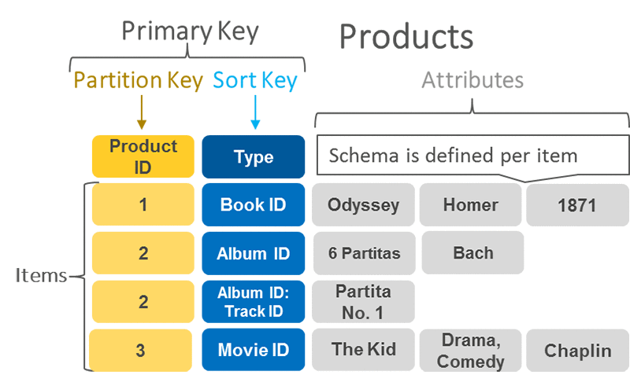
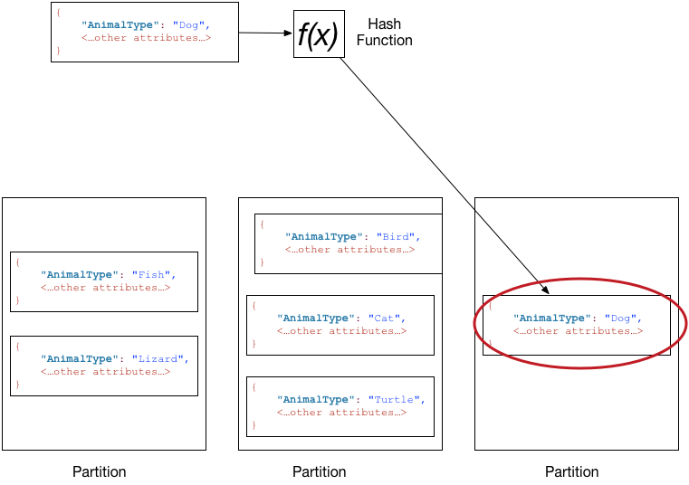
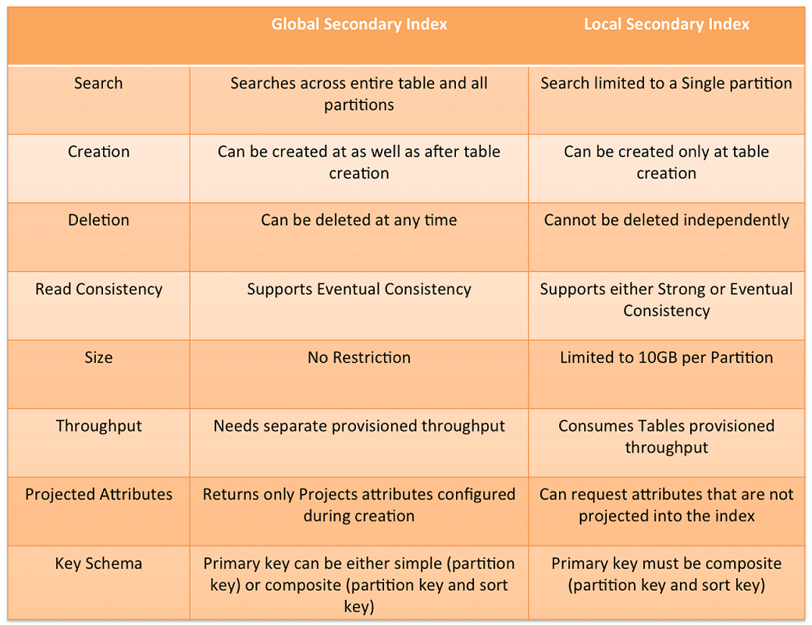
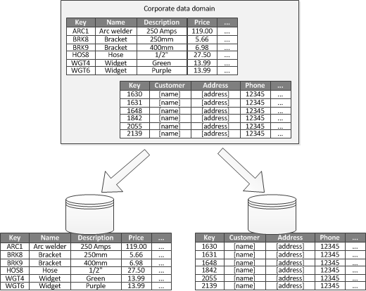
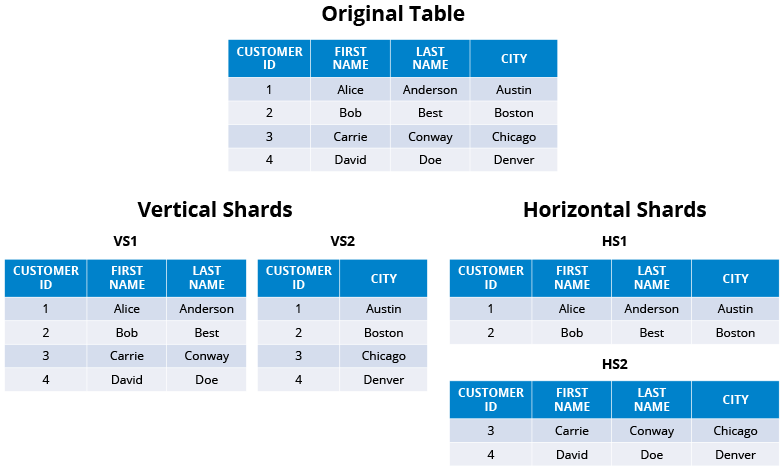

# DynamoDB

Amazon DynamoDB is a fully managed NoSQL database service that provides fast and predictable performance with seamless scalability. Ref: https://docs.aws.amazon.com/amazondynamodb/latest/developerguide/Introduction.html

## Getting started

**Available scripts are shell scripts that run in Linux/macOS operating systems. Use AWS commands directly if you are using Windows.**

1. Be sure that LocalStack is running.
2. Execute scripts available in the `scripts` folder.

```bash
$ scripts/01-get-all-tables.sh
```

### Available tables & access patterns

Access patterns or query patterns define how the users and the system access the data to satisfy business needs.  
Ref: https://docs.aws.amazon.com/prescriptive-guidance/latest/dynamodb-data-modeling/step3.html

---

* `localstack/dynamodb/1-partition-key-table.json`
   * Table name: **aws-playground-partition-key**
   * Description: A simple schema with only a partition key. Please notice that you don't need to include any non-key attribute definitions in AttributeDefinitions. DynamoDB is schemaless (except the key schema).
   * Access patterns:
     * Get a particular song based on ID
       * PK=Id
* `localstack/dynamodb/2-partition-and-sort-keys-table.json`
  * Table name: **aws-playground-partition-and-sort-keys**
  * Description: A simple schema with primary and sort keys.
  * Access patterns:
    * Get a particular song for a given artist
      * PK=Artist, SK=SongTitle
    * Get all songs for a given artist
      * PK=Artist
* `localstack/dynamodb/3-partition-and-sort-keys-table-gsi.json`
  * Table name: **aws-playground-partition-and-sort-keys-gsi**
  * Description: A simple schema with primary and sort keys and GSI with separate primary and sort keys.
  * Access patterns:
    * Get all songs associated with a given album.
      * AlbumTitle-index (GSI), PK=AlbumTitle
* `localstack/dynamodb/4-partition-and-sort-keys-table-lsi.json`
  * Table name: **aws-playground-partition-and-sort-keys-lsi**
  * Description: A simple schema with primary and sort keys and LSI with the same primary and a different sort key.
  * Access patterns:
    * Get the most prestigious songs for a given artist.
      * ArtistAwardsKeysOnly-index | ArtistAwardsInclude-index | ArtistAwardsAll-index (LSI), PK=Artist
  * Remarks:
    * LSI - allows you to perform a query on a single Hash-Key while using multiple different attributes to "filter" or restrict the query. Remember, Local Secondary indices must have the same hash key as the main table.
    * GSI - allows you to perform queries on multiple Hash-Keys in a table, but costs extra in throughput, as a result.
    * Ref: https://stackoverflow.com/questions/21381744/difference-between-local-and-global-indexes-in-dynamodb

Examples are based on:
- https://docs.aws.amazon.com/amazondynamodb/latest/developerguide/GettingStartedDynamoDB.html
- https://docs.aws.amazon.com/amazondynamodb/latest/developerguide/bp-modeling-nosql-B.html
- https://docs.aws.amazon.com/amazondynamodb/latest/developerguide/LSI.html

### AWS Workbench

NoSQL Workbench for Amazon DynamoDB is a cross-platform, client-side GUI application that you can use for modern database development and operations.

Reference: https://docs.aws.amazon.com/amazondynamodb/latest/developerguide/workbench.html

## DynamoDB knowledge

### Table definition

Ref: https://docs.aws.amazon.com/amazondynamodb/latest/APIReference/API_CreateTable.html

#### Request Syntax

```json
{
   "AttributeDefinitions": [ 
      { 
         "AttributeName": "string",
         "AttributeType": "string"
      }
   ],
   "BillingMode": "string",
   "DeletionProtectionEnabled": boolean,
   "GlobalSecondaryIndexes": [ 
      { 
         "IndexName": "string",
         "KeySchema": [ 
            { 
               "AttributeName": "string",
               "KeyType": "string"
            }
         ],
         "Projection": { 
            "NonKeyAttributes": [ "string" ],
            "ProjectionType": "string"
         },
         "ProvisionedThroughput": { 
            "ReadCapacityUnits": number,
            "WriteCapacityUnits": number
         }
      }
   ],
   "KeySchema": [ 
      { 
         "AttributeName": "string",
         "KeyType": "string"
      }
   ],
   "LocalSecondaryIndexes": [ 
      { 
         "IndexName": "string",
         "KeySchema": [ 
            { 
               "AttributeName": "string",
               "KeyType": "string"
            }
         ],
         "Projection": { 
            "NonKeyAttributes": [ "string" ],
            "ProjectionType": "string"
         }
      }
   ],
   "ProvisionedThroughput": { 
      "ReadCapacityUnits": number,
      "WriteCapacityUnits": number
   },
   "SSESpecification": { 
      "Enabled": boolean,
      "KMSMasterKeyId": "string",
      "SSEType": "string"
   },
   "StreamSpecification": { 
      "StreamEnabled": boolean,
      "StreamViewType": "string"
   },
   "TableClass": "string",
   "TableName": "string",
   "Tags": [ 
      { 
         "Key": "string",
         "Value": "string"
      }
   ]
}
```

Ref: https://docs.aws.amazon.com/amazondynamodb/latest/APIReference/API_CreateTable.html

### Provisioned vs On-Demand

**The provisioned throughput costs are for reads or writes per second for one hour.**

- Calculation examples
    - https://aws.amazon.com/dynamodb/pricing/provisioned/
    - https://repost.aws/questions/QUVegyWilbTFiFTozSygyj-A/questions/QUVegyWilbTFiFTozSygyj-A/cost-comparisons-of-dynamodb-provisioned-vs-on-demand?

### Partition key vs Sort key

DynamoDB supports two types of primary keys:
- Partition key: A simple primary key, composed of one attribute known as the partition key. Attributes in DynamoDB are similar in many ways to fields or columns in other database systems.
- Partition key and sort key: Referred to as a composite primary key, this type of key is composed of two attributes. The first attribute is the partition key, and the second attribute is the sort key. All data under a partition key is sorted by the sort key value. The following is an example.



Each primary key attribute must be a scalar (meaning that it can hold only a single value). The only data types allowed for primary key attributes are string, number, or binary. There are no such restrictions for other, non-key attributes.




Well-designed sort keys have two key benefits:
- They gather related information together in one place where it can be queried efficiently. Careful design of the sort key lets you retrieve commonly needed groups of related items using range queries with operators such as begins_with, between, >, <, and so on.
- Composite sort keys let you define hierarchical (one-to-many) relationships in your data that you can query at any level of the hierarchy.

For example, in a table listing geographical locations, you might structure the sort key as follows.
```
[country]#[region]#[state]#[county]#[city]#[neighborhood]
```

This would let you make efficient range queries for a list of locations at any one of these levels of aggregation, from country, to a neighborhood, and everything in between.

References: 
- https://repost.aws/knowledge-center/primary-key-dynamodb-table
- **Check out this guide:** https://aws.amazon.com/blogs/database/choosing-the-right-dynamodb-partition-key/
- https://docs.aws.amazon.com/amazondynamodb/latest/developerguide/HowItWorks.Partitions.html
- https://docs.aws.amazon.com/amazondynamodb/latest/developerguide/bp-sort-keys.html

### Global Secondary Index vs Local Secondary Index

Every item in Dynamo must have a unique primary key. The primary key is the base table index. A primary key must have a partition key and can optionally have a range key (also called a sort key). Within a partition, items are ordered by range key. Accessing items using a partition key is fast.

Secondary indexes allow you to query the table using an alternative key. A Local Secondary Index (LSI) has the same partition key as the primary key (index), but a different range key. The way to think about an LSI is that its the same data as the primary index (key), just ordered by a different attribute.

A Global Secondary Index (GSI) has a different partition key to the primary key and is therefore a different set of data.

One of the important differences between an LSI and GSI is that an LSI takes its throughput capacity from the base table, whereas you have to purchase GSI throughput capacity separately. Put another way, an LSI costs you nothing, and a GSI incurs extra costs over your base table.

Let's have a look at the Music table example. Let's say the base table has this schema;

```
Artist: (Primary Key) Partition Key
SongTitle: (Primary Key) Range Key
AlbumTitle:
DateOfRelease:
```

This table is a list of songs. I can access all the songs for an artist really efficiently (i.e. query by Artist using the partition key). When I do this query, the songs will be ordered by SongTitle. I can also access songs by Artist and SongTitle very efficiently using the unique primary key.

Now lets say I want to get all songs by an Artist but ordered by DateOfRelease. In the current schema I would need to get all the songs and then order them in my application. A good alternative would be to create a new index, with a partition key of Artist and a range key DateOfRelease. This will be a LSI because the partition key of the index (Artist) is the same as the partition key of the primary key. I do not need to purchase additional throughput capacity as this index will provision itself from the base table capacity.

Now lets say I want to access the songs by AlbumTitle, ordered by SongTitle, i.e. create lists of Albums. To do this efficiently I create a new index with partition key AlbumTitle and range key SongTitle. This is a GSI because the partition key is different to the primary key. This GSI must be provisioned separately to the base table and therefore costs extra.

In answer to your question, GenreAlbumTitle is a GSI because it has a different partition key to Music.

Ref: https://stackoverflow.com/questions/50081459/global-vs-local-secondary-indexes-in-dynamodb



### Strong vs Eventual consistency DynamoDB

DynamoDB supports eventually consistent and strongly consistent reads.

#### Eventually Consistent Reads

When you read data from a DynamoDB table, the response might not reflect the results of a recently completed write operation. The response might include some stale data. If you repeat your read request after a short time, the response should return the latest data.

#### Strongly Consistent Reads

Strong consistency means the latest data is returned, but, due to internal consistency methods, it may result with higher latency or delay. With eventual consistency, results are less consistent early on, but they are provided much faster with low latency. Ref: https://www.scylladb.com/glossary/eventual-consistency/

When you request a strongly consistent read, DynamoDB returns a response with the most up-to-date data, reflecting the updates from all prior write operations that were successful. However, this consistency comes with some disadvantages:
- A strongly consistent read might not be available if there is a network delay or outage. In this case, DynamoDB may return a server error (HTTP 500).
- Strongly consistent reads may have higher latency than eventually consistent reads.
- Strongly consistent reads are not supported on global secondary indexes.
- Strongly consistent reads use more throughput capacity than eventually consistent reads.

Ref: https://www.geeksforgeeks.org/dynamodb-read-consistency/

### Scan vs Query

- SCAN - is used when you don't know the partition key (i.e. full table scan to get the item)
- QUERY - is used when you know the partition key (i.e. sort key is optional)

In short, you will be "charged" for the total amount of items scanned (not the total amount of items returned). Ref: https://stackoverflow.com/questions/31534624/read-capacity-cost-of-a-dynamodb-table-scan

### Internal hashing DynamoDB

DynamoDB uses the partition key's value as input to an internal hash function. The output from the hash function determines the partition (physical storage internal to DynamoDB) in which the item will be stored.

- There is no way to hint DynamoDB how it should hash your partition key internally. Also, there's no such annotation for DynamoDBMapper.
- Since DynamoDB doesn't expose the internals of its hashing scheme, you shouldn't use any such assumptions in your system. That is because DynamoDB is free to change the former any time it wants, however rare that might be.
- DynamoDB actually hashes twice internally, because of which I don't think you should worry that much:
- It first hashes to avoid consecutive keys falling together. Check this forum entry.
- It hashes the above to decide which partition the record should go to.

Ref: https://stackoverflow.com/questions/42010547/what-is-the-internal-hash-function-for-uuids-in-dynamodb

### Hot partition

Hot partitions: throttles are caused by a few partitions in the table that receive more requests than the average partition. Not enough capacity: throttles are caused by the table itself not having enough capacity to service requests on many partitions. Ref: https://www.bluematador.com/docs/troubleshooting/aws-dynamo-throttling

In DynamoDB, a partition key that doesn't have a high cardinality can result in many requests targeting only a few partitions and resulting in a hot partition. A hot partition can cause throttling if the partition limits of 3000 RCU or 1000 WCU (or a combination of both) per second are exceeded. Ref: https://repost.aws/knowledge-center/dynamodb-table-throttled

**Cardinality** — a term to describe the degree of variation of a collection. High cardinality, lots of variations. Low cardinality, only a few kinds. An extreme case is UUID — max cardinality, but almost useless for query or search except a single-item Get operation. Be sure that whatever primary key you choose (combining your item's attributes), it created a key of high cardinality. Ref: https://medium.com/codex/how-it-feels-like-using-dynamodb-1c69fb748b29

### Sharding vs Partitioning

Sharding and partitioning are both about breaking up a large data set into smaller subsets. The difference is that sharding implies the data is spread across multiple computers while partitioning does not. Partitioning is about grouping subsets of data within a single database instance. Ref: https://hazelcast.com/glossary/sharding/

Partitioning can improve scalability, reduce contention, and optimize performance. It can also provide a mechanism for dividing data by usage pattern. For example, you can archive older data in cheaper data storage. Ref: https://learn.microsoft.com/en-us/azure/architecture/best-practices/data-partitioning

Data partitioning can improve scalability because running a database on a single piece of hardware is inherently limited. Ref: https://www.cockroachlabs.com/blog/what-is-data-partitioning-and-how-to-do-it-right/



**Sharding is a type of partitioning, such as Horizontal Partitioning (HP). Sharding is partitioning where data is split horizontally.**

There is also Vertical Partitioning (VP) whereby you split a table into smaller distinct parts. Normalization also involves this splitting of columns across tables, but vertical partitioning goes beyond that and partitions columns even when already normalized.



References:
- https://stackoverflow.com/questions/20771435/database-sharding-vs-partitioning
- https://docs.aws.amazon.com/amazondynamodb/latest/developerguide/bp-partition-key-sharding.html
- https://hazelcast.com/glossary/sharding/

Watch this: https://www.youtube.com/watch?v=hdxdhCpgYo8&list=PL9nWRykSBSFgkCmkYdEfmXHX71m1UybNL

## Example modeling for notes app

Possibly the simplest and most cost-effective way would be a single table:

- Table Structure 
  - note_id (uuid) / hash key 
  - user_id 
  - type 
  - text

Have two GSIs, one for "Get all notes of a certain user" and one for "Get all notes of a certain type (the less used query)":

GSI for "Get all notes of a certain user"
- user_id / hash key
- note_id (uuid) / range key
- type
- text

A little note on this - which of your queries is the most frequent: "Get all notes of a certain user" or "Get a specific note"? If it's the former, then you could swap the GSI keys for the table keys and vice-versa (if that makes sense - in essence, have your user_id + note_id as the key for your table and the note_id as the GSI key). This also depends upon how you structure your user_id - I suspect you've already picked up on; make sure your user_id is not sequential - make it a UUID or similar.

GSI for "Get all notes of a certain type (the less used query)"
- type / hash key
- note_id (uuid) / range key
- user_id
- text

Depending upon the cardinality of the type field, you'll need to test whether a GSI will actually be of benefit here or not.

If the GSI is of little benefit and you need more performance, another option would be to store the type with an array of note_id in a separate table altogether. Beware of the 400k item limit with this one and the fact that you'll need to perform another query to get the text of the note.

With this table structure and GSIs, you're able to make a single query for the information you're after, rather than making two if you have two tables.

Of course, you know your data best - it's best to start with what you think is best and then test it to ensure it meets what you're looking for. DynamoDB is priced by provisioned throughput + the amount of indexed data stored so creating "fat" indexes with many attributes projects, as above, if there is a lot of data then it could become more cost effective to perform two queries and store less indexed data.

Ref: https://stackoverflow.com/questions/47289226/dynamodb-partition-key-choice-for-notes-app

Other design & access patterns examples:
- https://www.sensedeep.com/blog/posts/2021/dynamodb-singletable-design.html
- https://docs.aws.amazon.com/amazondynamodb/latest/developerguide/bp-modeling-nosql-B.html

## Available libraries

- ksuid
  - Description: ksuid is an efficient, comprehensive, battle-tested Go library for generating and parsing a specific kind of globally unique identifier called a KSUID. This library serves as its reference implementation
  - Why: you can use it to generate your primary keys
  - Ref: https://github.com/segmentio/ksuid

## Recommended materials

- YT channel: Be A Better Dev
  - https://www.youtube.com/watch?v=Y8gMoZOMYyg
  - https://www.youtube.com/watch?v=_qSDFDnALtI
- AWS documentation & blogs
  - https://aws.amazon.com/blogs/database/choosing-the-right-dynamodb-partition-key/
- Best practises
  - https://docs.aws.amazon.com/amazondynamodb/latest/developerguide/bp-partition-key-design.html
- GitHub materials
  - Alex DeBrie (alexdebrie)
    - https://github.com/alexdebrie/awesome-dynamodb
    - https://github.com/alexdebrie/dynamodb-instagram
