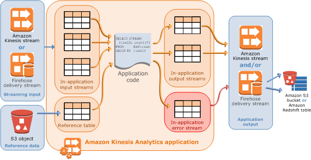
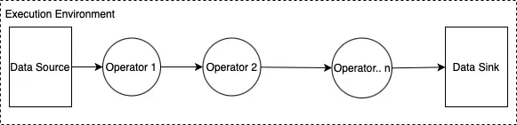
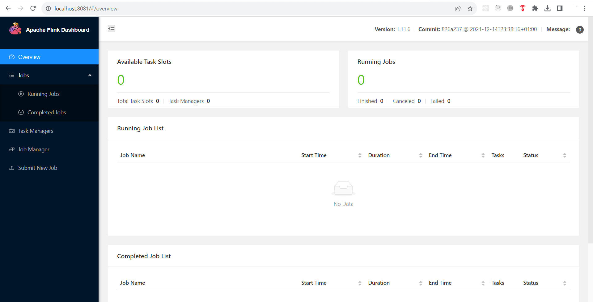

# Amazon Kinesis Data Analytics

With Kinesis Data Analytics (KDA) we can process and analyze streaming data. 
It provides an efficient and scalable environment to run applications built using the Apache Flink framework 
which provides useful operators like map, filter, aggregate, window, etc for querying streaming data.

References:
- https://reflectoring.io/processing-streams-with-aws-kinesis/
- https://docs.aws.amazon.com/kinesisanalytics/latest/dev/how-it-works.html

## Apache Flink

A basic structure of a Flink application is shown below:

In this diagram, we can observe the following components of the Flink application:

- **Execution Environment:** The execution environment of a Flink application is defined in the application main class and creates the data pipeline. The data pipeline contains the business logic and is composed of one or more operators chained together.
- **Data Source:** The application consumes data by using a source. A source connector reads data from a Kinesis data stream, an Amazon S3 bucket, etc.
- **Processing Operators:** The application processes data by using one or more operators. These processing operators apply transformations to the input data that comes from the data sources. After the transformation, the application forwards the transformed data to the data sinks. Please check out the Flink documentation to see the complete list of DataStream API Operators with code snippets.
- **Data Sink:** The application produces data to external sources by using sinks. A sink connector writes data to a Kinesis data stream, a Kinesis Data Firehose delivery stream, an Amazon S3 bucket, etc.

Flink use cases: https://flink.apache.org/use-cases/

References:
- https://reflectoring.io/processing-streams-with-aws-kinesis/
- https://www.capitalone.com/tech/cloud/aws-apache-flink/

## Getting started

Tested with:
- flink-1.8.2-bin-scala_2.11 & JDK 8
- flink-1.11.6-bin-scala_2.11 & JDK 11

Apache Flink playground: https://github.com/apache/flink-playgrounds

---

1. Download and unzip a proper Flink version
   - https://flink.apache.org/downloads/
2. Run a cluster script `/bin/start-cluster.sh`.
3. Access the Web UI: http://localhost:8081/
4. (Optional) Run an example job from `flink_dir/examples/`

Reference: https://nightlies.apache.org/flink/flink-docs-release-1.13/docs/try-flink/local_installation/

---

There are no examples related to KDA. It looks like there is no option to run it locally (LocalStack seems to not support KDA yet).