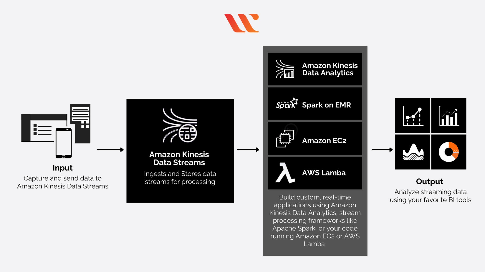
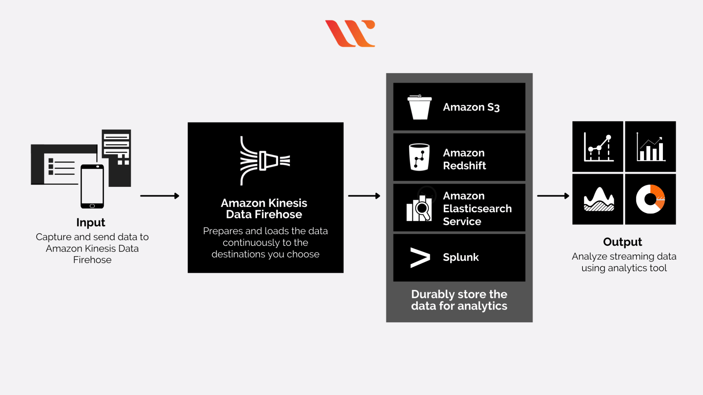
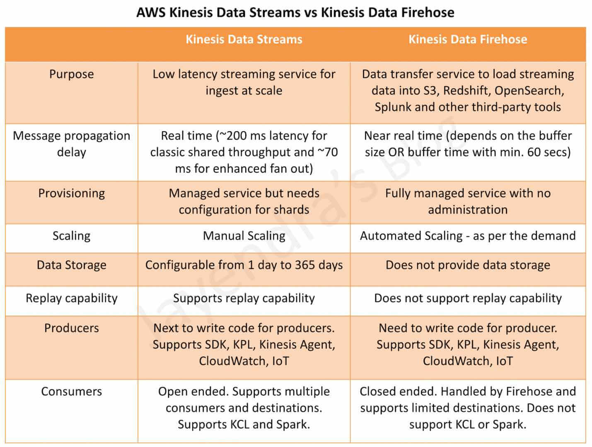
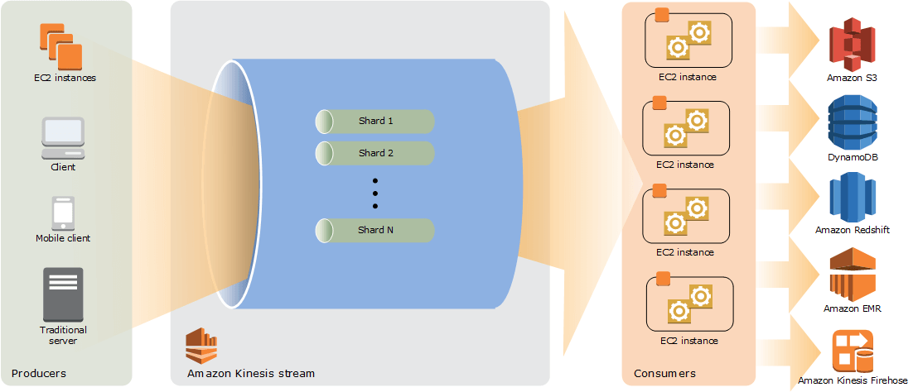
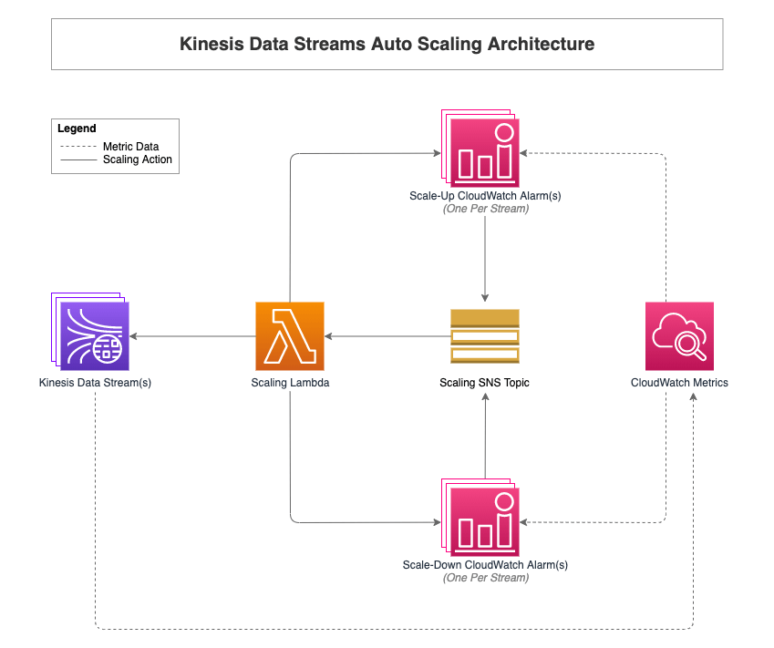
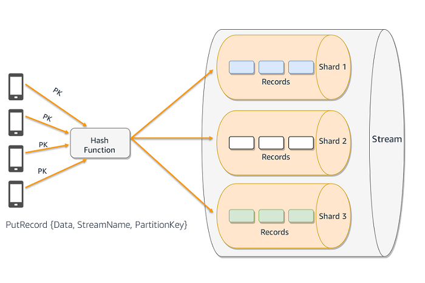

# Amazon Kinesis Data Streams

AWS Kinesis is the favorable choice for applications that use streaming data. Amazon introduced AWS Kinesis as a highly available channel for communication between data producers and data consumers. It serves as a formidable passage for streaming messages between the data producers and data consumers.

Data producers could come from almost any source of data such as social network data, mobile app data, system or weblog data, telemetry from connected IoT devices, financial trading information, and geospatial data.

On the other hand, data consumers would include references to data processing and storage applications such as Amazon Simple Storage Service (S3), Apache Hadoop, ElasticSearch, and Apache Storm.

Users could access different services with Amazon Kinesis, such as Kinesis Video Streams, Amazon Kinesis Data Streams, AWS Kinesis Data Firehose, and Kinesis Data Analytics. The following discussion aims to discuss the differences between Data Streams and Data Firehose.

Ref: https://www.whizlabs.com/blog/aws-kinesis-data-streams-vs-aws-kinesis-data-firehose/

## What is streaming data?

Streaming data is data that is generated continuously by thousands of data sources, which typically send in the data records simultaneously, and in small sizes (order of Kilobytes). 

Ref: https://aws.amazon.com/streaming-data/

## What are AWS Kinesis Data Streams and Data Firehose?

Before discussing the differences between Kinesis data streams and Firehose, it is important to understand Kinesis first. Amazon Kinesis is a significant feature in AWS for easy collection, processing, and analysis of video and data streams in real-time environments.

AWS Kinesis helps in real-time data ingestion with support for data such as video, audio, IoT telemetry data, application logs, analytics applications, website clickstreams, and machine learning applications. It supports effective data processing and analysis with instant response and does not have to wait for collecting all data for starting the processing work.

---



AWS Kinesis Data Streams and Firehose are the two distinct capabilities of Amazon Kinesis, which empower it for data streaming and analytics.

AWS Kinesis Data Streams is the real-time data streaming service in Amazon Kinesis with high scalability and durability. It can help in continuously capturing multiple gigabytes of data every second from multiple sources. As a matter of fact, it is the ideal choice for developers involved in developing custom applications or streaming data according to special needs. On

---



AWS Kinesis Data Firehose provides the facility of loading data streams into AWS data stores. Kinesis Data Firehose provides the simplest approach for capturing, transforming, and loading data streams into AWS data stores.

The automatic management of scaling in the range of gigabytes per second, along with support for batching, encryption, and compression of streaming data, are also some crucial features in Amazon Kinesis Data Firehose. Firehose also helps in streaming to RedShift, S3, or ElasticSearch service, to copy data for processing by using additional services.

Ref: https://www.whizlabs.com/blog/aws-kinesis-data-streams-vs-aws-kinesis-data-firehose/

---



https://jayendrapatil.com/aws-kinesis-data-streams-vs-kinesis-firehose/

## How does it work?



Kinesis Data Streams High-Level Architecture, ref: https://docs.aws.amazon.com/streams/latest/dev/key-concepts.html

---



Auto scaling Amazon Kinesis Data Streams using Amazon CloudWatch and AWS Lambda | AWS Big Data Blog, ref: https://aws.amazon.com/blogs/big-data/auto-scaling-amazon-kinesis-data-streams-using-amazon-cloudwatch-and-aws-lambda/

---



A Kinesis data stream is a set of shards.
A shard has a sequence of data records in a stream. Each shard provides a fixed unit of capacity.
The data stored in the shard is called a record.
Each data record has a sequence number that is assigned by the Kinesis Data Stream.

The total capacity of the data stream is the sum of the capacities of all the shards it is composed of.

The partition key determines to which shard the record is written. The partition key is a Unicode string with a maximum length of 256 bytes. Kinesis runs the partition key value that you provide in the request through an MD5 hash function. The resulting value maps your record to a specific shard within the stream, and Kinesis writes the record to that shard. Partition keys dictate how to distribute data across the stream and use shards.

Partition keys only matter when you have multiple shards in a stream (but they're required always). Kinesis computes the MD5 hash of a partition key to decide what shard to store the record on (if you describe the stream you'll see the hash range as part of the shard decription).

So why does this matter? Each shard can only accept 1,000 records and/or 1 MB per second (see PutRecord doc). If you write to a single shard faster than this rate you'll get a ProvisionedThroughputExceededException.

The real reason partitions are used is for "ordering/streaming". 
Kinesis maintains ordering (sequence number) for each shard.

In other words, by streaming X and afterwards Y to shard Z it is guaranteed, 
that X will be pulled from the stream before Y (when pulling records from all shards). 
On the other hand, by streaming X to shard Z1 and afterwards Y to shard Z2 there is no guarantee on the ordering 
(when pulling records from all shards). Y may definitely be pulled before X.

Use cases:
- a video service streaming a movie to a user using the username and the movie name as the partition key,
- working on a stream of common events, and applying aggregation.

References: 
- https://reflectoring.io/processing-streams-with-aws-kinesis/
- https://aws.amazon.com/blogs/big-data/under-the-hood-scaling-your-kinesis-data-streams/
- https://stackoverflow.com/questions/48399903/what-is-partition-key-in-aws-kinesis-all-about
- https://medium.com/@himanshu66/aws-kinesis-data-streams-cdec4adb9450

---

The AWS/Kinesis namespace includes the following shard-level metrics. Kinesis sends the following shard-level metrics to CloudWatch every minute. Each metric dimension creates 1 CloudWatch metric and makes approximately 43,200 PutMetricData API calls per month. These metrics are not enabled by default.

Ref: https://docs.aws.amazon.com/streams/latest/dev/monitoring-with-cloudwatch.html

## Examples of streaming data

- Sensors in transportation vehicles, industrial equipment, and farm machinery send data to a streaming application. The application monitors performance, detects any potential defects in advance, and places a spare part order automatically preventing equipment down time.
- A financial institution tracks changes in the stock market in real time, computes value-at-risk, and automatically rebalances portfolios based on stock price movements.
- A real-estate website tracks a subset of data from consumers’ mobile devices and makes real-time property recommendations of properties to visit based on their geo-location.
- A solar power company has to maintain power throughput for its customers, or pay penalties. It implemented a streaming data application that monitors of all of panels in the field, and schedules service in real time, thereby minimizing the periods of low throughput from each panel and the associated penalty payouts.
- A media publisher streams billions of clickstream records from its online properties, aggregates and enriches the data with demographic information about users, and optimizes content placement on its site, delivering relevancy and better experience to its audience.
- An online gaming company collects streaming data about player-game interactions, and feeds the data into its gaming platform. It then analyzes the data in real-time, offers incentives and dynamic experiences to engage its players.

## Difference between Batch Processing and Stream Processing

Batch processing involves processing large volumes of data at once in batches or groups. The data is collected and processed offline, often on a schedule or at regular intervals. Stream processing, on the other hand, involves processing data in real-time as it is generated or ingested into the system. 

Ref: https://www.geeksforgeeks.org/difference-between-batch-processing-and-stream-processing/

https://www.whizlabs.com/blog/aws-kinesis-data-streams-vs-aws-kinesis-data-firehose/


## Scripts

In order to successfully run scripts, install `jq`.

On Windows:
```
choco install jq
```

Ref: https://stackoverflow.com/questions/53967693/how-to-run-jq-from-gitbash-in-windows
